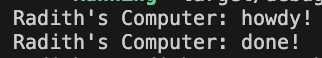
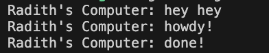

## Experiment1.1

## Experiment 1.2

Explanation:
When we call spawner.spawn, the async block is not executed immediately. Instead, it is packaged as a task and sent into a channel queue. Because this enqueueing process is instant and non-blocking, the main thread immediately proceeds to execute the next synchronous instruction, printing "hey hey". The async task remains waiting in the queue until the event loop is explicitly started via executor.run(), which finally pulls the task out and prints "howdy!".