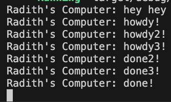
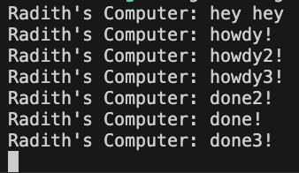

## Experiment1.1

## Experiment 1.2

Explanation:
When we call spawner.spawn, the async block is not executed immediately. Instead, it is packaged as a task and sent into a channel queue. Because this enqueueing process is instant and non-blocking, the main thread immediately proceeds to execute the next synchronous instruction, printing "hey hey". The async task remains waiting in the queue until the event loop is explicitly started via executor.run(), which finally pulls the task out and prints "howdy!".

## Experiment 1.3

Explanation:
All three tasks print "howdy" immediately because the executor runs them all at the same time the moment executor.run() starts. The order of the "done" messages shifts slightly between my runs because all three timers finish sleeping at almost the exact same millisecond. Finally, the program freezes at the very end because commenting out drop(spawner) keeps the communication channel open, forcing the executor to wait forever for new tasks.